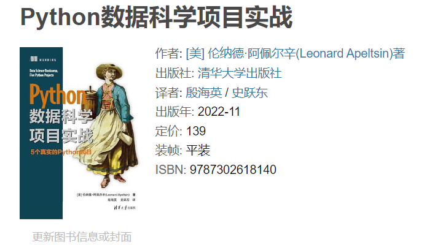

# Breadcrumbsdata-science-bookcamp-with-five-python-projects

书籍如下所示：

地址为：https://book.douban.com/subject/36139055/ 。

# 书籍内容实现

| Case | 书籍源代码地址                                               | 我的实现代码地址                                             |
| ---- | ------------------------------------------------------------ | ------------------------------------------------------------ |
| 1    | [Case 1](https://github.com/YeJiu97/data-science-bookcamp-with-five-python-projects/tree/main/scr/Case_Study1) | [案例一：在纸牌游戏中寻找制胜策略](https://github.com/YeJiu97/data-science-bookcamp-with-five-python-projects/blob/main/%E6%A1%88%E4%BE%8B%E4%B8%80%EF%BC%9A%E5%9C%A8%E7%BA%B8%E7%89%8C%E6%B8%B8%E6%88%8F%E4%B8%AD%E5%AF%BB%E6%89%BE%E5%88%B6%E8%83%9C%E7%AD%96%E7%95%A5.ipynb) |
| 2    | [Case 2](https://github.com/YeJiu97/data-science-bookcamp-with-five-python-projects/tree/main/scr/Case_Study2) | [案例二：评估在线广告点击的显著性](https://github.com/YeJiu97/data-science-bookcamp-with-five-python-projects/blob/main/%E6%A1%88%E4%BE%8B%E4%BA%8C%EF%BC%9A%E8%AF%84%E4%BC%B0%E5%9C%A8%E7%BA%BF%E5%B9%BF%E5%91%8A%E7%82%B9%E5%87%BB%E7%9A%84%E6%98%BE%E8%91%97%E6%80%A7.ipynb) |
| 3    | [Case 3](https://github.com/YeJiu97/data-science-bookcamp-with-five-python-projects/tree/main/scr/Case_Study3) | TBC                                                          |
| 4    | [Case 4](https://github.com/YeJiu97/data-science-bookcamp-with-five-python-projects/tree/main/scr/Case_Study4) | TBC                                                          |
| 5    | [Case 5](https://github.com/YeJiu97/data-science-bookcamp-with-five-python-projects/tree/main/scr/Case_Study5) | TBC                                                          |

每个Case的Solution可以在线查看，在Manning出版社的官方网站上：https://www.manning.com/books/data-science-bookcamp 。

# 书籍评价

总体评分：⭐⭐⭐⭐⭐/⭐⭐⭐⭐⭐。

书籍的内容非常的好，从定位来看是一本关于实战的书籍，但是在进入到Case之前会实现一些代码来了解实现或者解决这个Case需要的知识点。

如果读者的Python语言能力较差或者缺乏了一些基础的统计或者概率相关的基础知识，那么不是非常推荐直接上来就使用这本书。这本书对于数据科学的初学者来讲有着一定的难度，另外书籍的工作量较为繁重（如果要仔细的学习，复现和理解代码）。

此外书籍还使用了大量的推导式来生成列表，有时候还伴随着条件判断，有时候会有思路复现上的困难。

在平多多上正版的价格在活动期间大概在70±5人民币，性价比超高。
